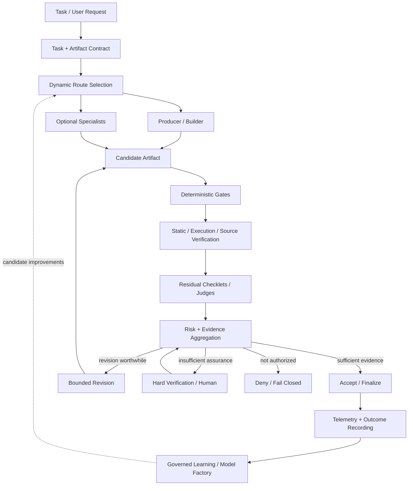

<h1 align="center">Reusable Core</h1>

<p align="center">
  <strong>Verification-first infrastructure for dynamically composed autonomous systems.</strong>
</p>

<p align="center">
  <a href="pyproject.toml"></a>
  <a href="docs/verification/v1-shadow-verification.md"></a>
  <a href="#status"></a>
  <a href="#trusted-authority-layer"></a>
  <a href="https://github.com/markwuenschel-dev/Reusable-Core/commits/main"></a>
  <a href="LICENSE.md"></a>
</p>

> A dynamically composed, domain-agnostic agent runtime in which every agent, model call, verifier, handoff, and autonomous action must earn its keep.

## Status

**Early-stage research and implementation.**

This repository is building a reusable autonomous-agent architecture rather than a fixed multi-agent workflow.

The project is based on the **Reusable Core** research program and its central design rule:

> Agents are optional execution strategies.  
> Artifacts, contracts, verification, authority, telemetry, and promotion rules are the durable core.

The architecture is intentionally designed to support anything from a single strong model call to a dynamically composed multi-agent workflow, depending on the task, risk, available evidence, and measured value of specialization.

---

## Goals

The system is intended to answer five practical questions at runtime:

1. **What needs to be done?**
2. **What is the cheapest competent way to do it?**
3. **What evidence is required before the result can be trusted?**
4. **What actions is the executor actually authorized to perform?**
5. **When is additional reasoning, verification, or coordination no longer worth its cost?**

The target is not "maximum agents."

The target is:

> maximum verified task quality under bounded risk, controlled cost, explicit authority, and measurable system behavior.

---

## Core Design Principles

### 1. Every agent earns its keep

No role is permanently justified by its name.

Planner, architect, researcher, builder, critic, verifier, documentor, and other specialists are invoked only when they demonstrate measurable value on the task slices that need them.

A strong single-agent path remains a first-class baseline and fallback.

### 2. Verification comes before judgment

The system uses the strongest available signal first:

1. task and contract validation
2. deterministic validation
3. static analysis
4. execution and simulation
5. source, claim, and citation verification
6. calibrated residual model judgment
7. human review where necessary

An LLM judge cannot override a failed objective gate.

### 3. Competence is not authority

A model may be capable of proposing an action without being permitted to perform it.

Generation, verification, authorization, and effect execution are separate concerns.

Models and agents are treated as replaceable executors rather than trusted principals.

### 4. Evidence is not truth

Tests, verifier outputs, citations, model judgments, traces, and human labels all have explicit applicability and failure boundaries.

Agreement between multiple models does not automatically become independent evidence.

### 5. Optimization is not governance

Routers and learned policies may optimize:

- model selection
- specialist invocation
- verification allocation
- latency
- cost
- revision strategy

They may not silently waive mandatory verification, expand authority, or promote their own successors.

### 6. Best validated artifact wins

The newest artifact is not automatically the best artifact.

Revision loops are bounded and the system retains the best validated version rather than assuming repeated self-refinement monotonically improves quality.

---

## High-Level Architecture



---

## Architectural Layers

### Reusable Control Plane

The domain-agnostic control plane owns:

- task intake
- artifact contracts
- routing
- budgets
- role invocation
- artifact lineage
- handoffs
- verification orchestration
- revision policy
- stopping policy
- escalation
- telemetry
- promotion rules

### Domain Packs

Domain packs specialize the reusable core without changing its constitutional behavior.

A domain pack may define:

- artifact schemas
- specialist checklets
- deterministic rules
- executable tests
- source-verification logic
- subjective rubrics
- benchmark tasks
- risk thresholds
- required tools
- human-review triggers
- domain-specific telemetry

Initial target domains include:

- software and RAG engineering
- research and grounded synthesis
- UE5 and game-development workflows
- creative writing
- documentation

### Trusted Authority Layer

Consequential effects are separated from model execution.

The long-term architecture includes a small trusted authority layer responsible for:

- workload identity
- policy composition
- authorization
- effect mediation
- grants
- transactional effect state
- invalidation
- release authority
- certificate state
- audit integrity

Models, routers, agent frameworks, workflow engines, and verifier models remain outside this authority boundary.

---

## Agent Model

The system may expose familiar roles such as:

| Role | Responsibility |
|---|---|
| Orchestrator | Routing, budget, stop/escalation decisions |
| Planner | Task decomposition and acceptance criteria |
| Architect | Interfaces, structure, dependencies, invariants |
| Researcher | External evidence acquisition and source mapping |
| Builder | Produces code, prose, assets, research artifacts, or other deliverables |
| Critic / Verifier | Localizes defects using grounded evidence |
| Documentor | Produces trace-backed user-facing documentation |

These are **capability categories, not mandatory pipeline stages**.

A task may use:

```text
Builder
```

or:

```text
Orchestrator
  -> Builder
  -> Deterministic Verification
```

or:

```text
Orchestrator
  -> Planner
  -> Parallel Researchers
  -> Builder
  -> Specialized Checklets
  -> Hard Verification
  -> Bounded Revision
  -> Finalization
```

The route is selected according to task requirements and measured marginal value.

---

## Specialized Checklets

Broad generic criticism is not the target architecture.

The system instead supports narrow, structured evaluators called **checklets**.

A checklet should generally:

- evaluate one bounded criterion
- emit structured findings
- include confidence and evidence
- abstain when appropriate
- avoid rewriting the entire artifact
- be calibrated against an appropriate reference
- earn continued use through measured value

Examples:

### Software

- compile-risk check
- test-adequacy check
- security check
- changed-file risk
- dependency risk
- API-contract verification

### Research

- claim-support verification
- citation fidelity
- freshness
- contradiction detection
- source diversity

### Writing

- continuity
- POV / tense
- dialogue voice
- pacing
- imagery
- spatial / combat clarity
- emotional arc
- style drift

### UE5

- missing references
- asset naming
- dependency cycles
- Blueprint compile risk
- map-load validation
- performance-budget checks

Many checklets may diagnose.

A bounded builder/reviser owns the actual modification.

---

## Selective Verification

One of the primary research goals is to reduce expensive hard verification without increasing serious escaped defects.

The core decision is therefore not:

> "Did the model say this is good?"

It is:

> "Is there enough calibrated evidence to safely waive additional verification?"

Important metrics include:

- false-waiver rate
- waiver coverage
- defect escape rate
- false-block rate
- verifier precision and recall
- revision gain
- handoff loss
- route regret
- cost per accepted artifact
- latency
- tool efficiency

High-risk or poorly calibrated cases fail closed or escalate.

---

## Artifact-First Design

The architecture treats artifacts as the stable interface between reasoning stages.

Examples include:

- `TaskBrief`
- `RouteDecision`
- `Plan`
- `ArchitectureSpec`
- `EvidencePack`
- `CandidateArtifact`
- `CheckletObservation`
- `VerdictPacket`
- `RevisionDiff`
- `AuthorityGrant`
- `Certificate`
- `FinalRelease`

Artifacts should be:

- typed where possible
- schema validated
- versioned
- content-addressed where appropriate
- traceable to their inputs
- independently verifiable

This reduces lossy free-text handoffs and enables deterministic replay, auditing, and experimentation.

---

## Telemetry and Evaluation

The system is designed to be measurable from the beginning.

Each run should eventually expose structured trace information for:

```text
task
route
model invocation
agent invocation
tool call
artifact write
handoff
verification gate
judge/checklet verdict
revision
authorization
external effect
stop/escalation decision
final outcome
```

Evaluation is organized around four dataset roles:

- **development** — workflow and prompt iteration
- **calibration** — thresholds, judges, routers, and risk models
- **regression** — frozen historical failures
- **holdout** — promotion decisions

The strong matched single-agent system is the primary baseline.

Multi-agent configurations must beat that baseline under controlled budgets rather than merely consume more compute.

---

## Governed Learning

The long-term system includes a self-improving model portfolio.

Production experience may be used to train:

- routers
- specialist models
- verifier models
- risk predictors
- handoff-loss detectors
- judge calibrators
- revision-gain predictors
- anomaly detectors

However:

> The learning system may produce candidates.  
> It may not authorize its own promotion.

Candidate improvements must pass independent evaluation and the same governance and verification requirements as any other production change.

---

## Research Program

Major active research areas include:

- dynamic composition
- selective verification
- specialist checklets
- graph-based orchestration
- best-of-N versus iterative revision
- runtime-substrate independence
- capability routing
- swarm admission
- durable execution
- governed memory
- capability containment
- verification-budget-aware scheduling
- federated execution
- compositional certification
- certification durability
- recursive epistemic stability
- model portfolio optimization

A research result does not become architecture merely because it is promising.

Promotion requires empirical evidence.

---

## Current Build Priorities

Initial implementation should prioritize:

1. artifact contracts and schemas
2. deterministic fail-closed validation
3. strong single-agent baseline
4. trace and event instrumentation
5. evaluation harness
6. reduced default execution loop
7. specialist checklet interface
8. hard-verification interface
9. dynamic routing
10. calibrated risk aggregation
11. authority and effect mediation
12. governed learning infrastructure

---

## Current Experimental Implementation

The initial [Verification Slice V1](docs/verification/v1-shadow-verification.md) implements content-bound coding-artifact verification with deterministic diagnostic checklets, append-only telemetry, replay, fixture evaluation, and a mandatory hard-verifier boundary. Its shadow `would_waive` result is counterfactual evidence only and never authorizes acceptance or a release.

Run the fixture suite with:

```powershell
python -m unittest discover -s tests -v
python -m verification_v1 evaluate evals/verification_v1/engineering_fixture_set.json --report-dir reports/verification_v1
```

---

## Non-Goals

This project is not intended to be:

- a fixed seven-agent chain
- an LLM group chat with role names
- a framework that assumes more agents are better
- a system where model confidence grants authority
- an autonomous self-modifying production system without independent promotion
- a replacement for deterministic verification where deterministic verification exists
- a system that treats telemetry as proof
- a system that treats model agreement as truth

---

## Repository Status

Interfaces, schemas, package boundaries, and implementation details are expected to evolve rapidly while the initial experimental harness is built.

Until a component is explicitly marked otherwise:

> **Research proposal does not imply production authority.**

---

## License

This repository is proprietary.

No permission is granted to copy, modify, distribute, sublicense, publish, sell, or commercially exploit the software or associated materials except under a separate written agreement with the copyright holder.

See [`LICENSE.md`](LICENSE.md).

---

## Disclaimer

This repository contains experimental autonomous-agent, machine-learning, verification, and security architecture work.

No implementation should be treated as production-safe solely because it follows a design described in this repository. Production claims require implementation-specific validation, threat modeling, testing, and certification.
