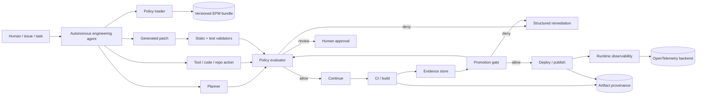
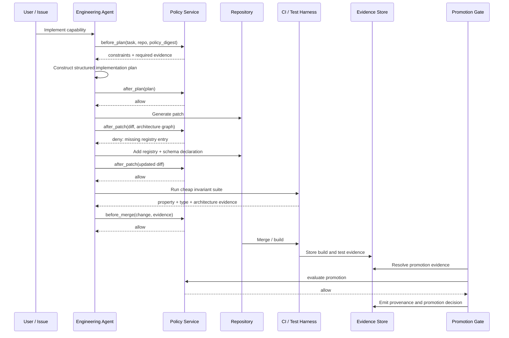

# A Software-Engineering Specification for Enforceable Programming Principles in Autonomous-Agent Workflows

## Executive summary

The most effective software-engineering version of a programming-guidelines document is **not a longer style guide and not a larger system prompt**. It is an **executable engineering-policy system** in which prose principles are compiled into requirements, machine-readable rules, enforcement hooks, tests, evidence, and promotion gates.

Your uploaded *Programming Principles* already contains the conceptual ingredients for such a system: contracts and typed boundaries; registries, factories, schemas, and planners as evolution surfaces; canonical intermediate representations; functional-core/imperative-shell separation; determinism and point-in-time correctness; content-addressed artifact lineage; isolated performance kernels; cheap always-on invariants; heavier validation at promotion; structured observability; and adaptation that preserves contracts. fileciteturn0file0 The important transformation is therefore:

> **principle → requirement → enforceable rule → enforcement point → evidence → exception policy → compliance metric**

I recommend implementing this as a layered **Engineering Policy Manifest**, or EPM:

1. **YAML/JSON policy manifests** are the human-authoring surface.
2. **JSON Schema Draft 2020-12** validates policy structure and typed configuration. JSON Schema is specifically designed to describe and assert constraints over JSON documents, supports reusable referenced schemas, and defines machine-readable validation output. citeturn5search0turn5search3
3. **OPA/Rego** handles semantic and contextual rules that cannot be expressed adequately as structural schema constraints—for example, “production artifacts require lineage metadata,” “an exception must not authorize a blocker after its expiry,” or “a deployment may proceed only when required evidence exists.” OPA intentionally separates policy decision-making from enforcement and evaluates policies over structured input. citeturn1search2turn6search4
4. **OpenAPI 3.2** defines the agent/policy-service API rather than serving as the primary policy language. OpenAPI is a language-neutral description of HTTP interfaces and can represent its documents in JSON or YAML; its Schema Object builds on JSON Schema. citeturn0search0
5. **SLSA provenance** is used for released/build artifacts and promotion evidence, tying outputs to builders, parameters, dependencies, and artifact digests. The current SLSA specification is version 1.2 and explicitly treats provenance as verifiable information about where, when, and how software artifacts were produced. citeturn1search5turn1search6
6. **OpenTelemetry** supplies the vendor-neutral runtime telemetry plane for policy decisions, agent runs, tool executions, evidence generation, and enforcement failures. OpenTelemetry standardizes traces, metrics, and logs and supports correlation between them. citeturn3search0turn3search2turn3search3

The key design decision is to **separate severity from enforcement effect**. A rule may be technically severe but temporarily advisory during migration, or low-severity but mechanically enforced because enforcement is cheap. A rule therefore needs both, for example:

```text
severity = blocker
effect   = deny
```

versus:

```text
severity = warning
effect   = report
```

That distinction makes gradual rollout possible without weakening the semantic meaning of the policy.

The system should also preserve your current distinction between **development correctness and production promotion**. Cheap, catastrophic invariants such as schema correctness, leakage/PIT safety, determinism, hash stability, round-trip correctness, and planner/executor consistency remain continuously enforced; expensive statistical, performance, supply-chain, or production-readiness evidence is evaluated at the appropriate promotion boundary. That directly reflects your uploaded principles rather than imposing a heavyweight “everything must pass everything on every edit” regime. fileciteturn0file0

The resulting architecture is best understood as a **policy compiler plus enforcement mesh**, not as an “AI coding guideline.” Autonomous agents become one class of client. Humans, IDEs, pre-commit hooks, CI, build systems, deployment controllers, and production monitors consume the same policy and evidence model.

## From programming principles to engineering controls

Although your prompt asks for a generic format that can accept future specifics, the uploaded principles provide a useful worked profile. The design below therefore keeps the **schema platform- and language-neutral** while showing how your existing philosophy maps into enforceable engineering artifacts. fileciteturn0file0

A concise portable extraction of the guidelines is:

**Contracts over concrete implementations.** Components communicate through narrow, typed contracts and value objects rather than implicit assumptions or deep implementation coupling.

**Declarative variation over imperative branching.** Schemas, manifests, registries, factories, planners, and canonical intermediate representations carry variation.

**One semantic path per layer.** Authoring may have many front doors, but equivalent semantics lower into one canonical representation and execution path.

**Pure computation separated from effects.** Deterministic computation belongs in the functional core; I/O, clocks, persistence, networking, and other side effects remain explicit at boundaries.

**Correctness boundaries are architectural.** Domain invariants—such as point-in-time data access in the supplied quant-oriented principles—must be enforced by interfaces and types where possible rather than left to developer memory.

**Reproducibility and lineage are first-class.** Determinism tiers, stable hashes, registry/schema versions, seeds, partitions, inputs, and artifact provenance provide reconstruction and auditability.

**Performance optimization is localized.** Batch/vectorized/parallel computation is preferred, while opaque optimized kernels must remain isolated, benchmarked, instrumented, and checked against readable reference behavior.

**Cheap catastrophic invariants are continuous.** Property-oriented safety checks run throughout development.

**Heavy evidence belongs at promotion boundaries.** Production-readiness evidence is generated by shared harnesses rather than reimplemented by every feature.

**Failures and operations are structured.** Typed errors, tracing, metrics, structured logs, explicit execution IDs, and no silent failure are part of correctness.

**Adaptation changes data, models, configuration, or replaceable components without erasing contracts.** The evolution surface remains schemas/factories/registries/planners rather than self-modifying source. fileciteturn0file0

The engineering-spec translation looks like this:

| Principle | Requirements | Architecture pattern | Coding standard | Tests | CI/CD checks | Monitoring | Documentation |
|---|---|---|---|---|---|---|---|
| Contract-guided boundaries | Every cross-component boundary has an explicit contract; invalid states rejected at construction | Ports/adapters; typed boundary models; narrow protocols | No caller dependence on implementation-private fields; explicit domain errors | Contract tests; serialization round-trips; generated invalid-input tests | Type/schema validation; API compatibility checks | Contract-error rate; schema-version mismatches | Interface contract, compatibility policy, examples |
| Declarative/schema-first | Configurable behavior must first be expressible as schema/config/registry/planner data unless an exception is justified | Schema-driven configuration; registries; factories | Avoid bespoke branches for ordinary variation | Schema positive/negative suites; manifest round-trips | Validate every changed manifest; detect unregistered identifiers | Invalid-manifest count; deprecated configuration usage | Schema reference; registry catalog; migration notes |
| Canonical semantic path | Equivalent authoring inputs lower into one canonical IR | Compiler-style spec → IR → validation → plan → execution | No parallel permanent execution paths for same semantic layer | Golden lowering tests; equivalent-input properties | Architecture test rejects bypass paths | IR version; lowering failures; divergent-plan metrics | IR specification; stage ownership |
| Functional core / imperative shell | Effects must be restricted to declared boundaries | Pure core plus adapters/shell | No hidden clocks, network, filesystem, or mutable globals in core | Determinism tests; injected-effect tests | Static dependency/architecture rules | Effect-boundary violations; retry/error metrics | Effect model and adapter contracts |
| Temporal/PIT integrity | Time-sensitive data access occurs only through approved time-aware interfaces | Capability-style `as_of` data interface | Raw time-sensitive stores inaccessible from domain computation | Leakage properties; generated boundary timestamps | Dependency/import rule; mandatory PIT suite | Boundary violation count; latest accepted knowledge/valid time | Temporal semantics and examples |
| Reproducibility and lineage | Promoted results identify spec, code, registry/schema, inputs, seeds, partitions, builder, and artifacts | Content-addressed artifacts; provenance graph | Stable ordering/hashing; explicit randomness | Hash stability; repeat-run tests; seed lineage properties | Provenance verification; determinism gate | Reproduction success rate; provenance completeness | Determinism tiers; provenance schema; replay runbook |
| Parallel/vectorized execution | Work partitioning occurs on declared stable axes; cross-partition coordination is explicit | Data-parallel plan/executor | Avoid accidental element-at-a-time orchestration on hot paths | Partition-equivalence tests; race/concurrency tests | Performance regression checks where declared | Throughput, partition skew, retry rate, memory materialization | Partitioning model; performance envelope |
| Isolated hot kernels | Non-obvious optimized code requires a reference implementation and benchmark evidence | Sealed kernel behind stable interface | Optimization does not leak complexity to callers | Reference-vs-optimized conformance; fuzz/property tests | Benchmark threshold and conformance gate | Latency, throughput, memory, numerical divergence | Benchmark rationale and optimization assumptions |
| Continuous cheap invariants | Every catastrophic cheap invariant has an executable check | Shared invariant harness | Feature code does not bypass invariant runner | Property-based and unit tests | Fast suite mandatory on PR | Failure frequency; flaky-test rate | Invariant catalog with rationale |
| Promotion-gated heavy evidence | Expensive evidence generated once by shared promotion infrastructure | Promotion/evaluation harness | Features provide inputs to harness rather than custom evidence plumbing | Harness integration and scenario tests | Promotion policy denies absent/stale evidence | Gate failure reasons; evidence age | Promotion policy and evidence definitions |
| Observability and typed failures | Every important execution has identity and correlated structured telemetry; silent failures forbidden | Instrumented execution pipeline | Typed exception translation; no bare catch-and-ignore | Error-path tests; telemetry contract tests | Lint forbidden exception patterns; telemetry schema check | Errors, traces, policy decisions, evidence latency | Error taxonomy; tracing conventions; operational runbooks |
| Controlled adaptation | Runtime adaptation may update permitted state/configuration but not silently alter governing contracts | Replaceable component/state model | Self-modification requires explicit separately governed mechanism | Compatibility and rollback tests | Registry/schema compatibility gate | Drift, model/config versions, rollback events | Adaptation model and rollback policy |

This table is deliberately broader than linting. Some principles have a natural static enforcement mechanism; others require dynamic evidence. Trying to force all of them into a source-code linter would create a false sense of enforcement.

A useful taxonomy is therefore:

| Rule class | Example | Best evidence |
|---|---|---|
| **Structural** | Every rule has owner/severity; manifests contain schema version | JSON Schema validation |
| **Syntactic** | Forbidden exception form; forbidden import/dependency | AST/static-analysis result |
| **Architectural** | Core package may not depend on network adapter | Dependency graph / architecture test |
| **Semantic** | Production execution requires approved provenance | Rego decision over context |
| **Behavioral** | Optimized implementation is equivalent to reference | Unit/property/conformance result |
| **Nonfunctional** | Kernel remains within performance envelope | Benchmark artifact |
| **Operational** | Every promoted run emits trace and lineage IDs | Runtime telemetry |
| **Governance** | Blocker exception requires two authorized approvers and expiration | Signed approval record |

Property-based testing is particularly aligned with your “invariants are authoritative; examples support them” philosophy. The foundational QuickCheck work formalized the idea of specifying executable properties and testing them across generated inputs rather than relying only on manually selected examples. citeturn7search1

## Machine-readable specification design

The strongest option is a **hybrid rather than choosing JSON Schema, OpenAPI, Rego, or a custom DSL exclusively**.

JSON Schema is excellent for document structure and local assertions, including reusable `$ref` resources and standardized validation outputs. It is not intended to be a general evaluator of repository graphs, historical build state, external approval records, or runtime context. citeturn5search0turn5search6 Rego, by contrast, is explicitly a declarative policy language for reasoning over structured documents and making policy decisions, which makes it suitable for those contextual rules. citeturn1search2 OpenAPI should describe the network interface through which agents and CI query enforcement services; the OpenAPI specification itself defines a language-agnostic HTTP interface description and supports JSON/YAML documents. citeturn0search0

| Format | Best role | Strengths | Weaknesses for this use case | Recommendation |
|---|---|---|---|---|
| **JSON Schema 2020-12** | Policy/manifests/configuration shape | Standard, language-neutral, references, validation tooling, machine-readable errors | Weak for repository-wide/contextual decisions | **Mandatory base layer** |
| **OpenAPI 3.2** | Policy service and agent APIs | Standard HTTP contract, schema integration, code/tool generation ecosystem | An API-description language, not a full engineering-policy language | **Use for interfaces only** |
| **OPA/Rego** | Cross-artifact and contextual policy | Declarative decisions over arbitrary structured inputs; separate policy from enforcement | More specialized; requires policy runtime/tooling | **Use for semantic rules** |
| **Custom DSL** | Friendly authoring of recurring engineering rules | Can map closely to your vocabulary | Parser, tooling, IDE, versioning, security and semantics become your burden | Add later only if YAML becomes painful |
| **Hybrid EPM** | Overall control plane | Structural validation + semantic policy + standard APIs + provenance | More components | **Recommended** |

OPA can be embedded or queried through its REST/Data APIs, and its policy tests can emit machine-readable JSON for CI use. citeturn6search0turn6search1turn6search7 That makes it practical to treat Rego policy modules like any other tested engineering artifact rather than opaque production configuration.

**Recommended logical object model:**

```text
EngineeringPolicyManifest
├── metadata
│   ├── id
│   ├── version
│   ├── owners
│   ├── policy_digest
│   └── source_references
├── defaults
│   ├── severity
│   ├── effect
│   └── fail_mode
├── principles[]
├── rules[]
│   ├── identity / rationale
│   ├── scope
│   ├── assertion
│   ├── severity
│   ├── enforcement
│   ├── evidence
│   ├── remediation
│   └── exception_policy
├── profiles[]
│   └── domain/platform overlays
└── governance
    ├── approval classes
    ├── policy-change rules
    └── retention
```

A **minimal JSON Schema** for the rule envelope could look like this:

```json
{
  "$schema": "https://json-schema.org/draft/2020-12/schema",
  "$id": "https://engineering.example/spec/epm-rule.schema.json",
  "title": "Engineering Policy Rule",
  "type": "object",
  "additionalProperties": false,
  "required": [
    "id",
    "title",
    "principles",
    "scope",
    "assertion",
    "severity",
    "enforcement"
  ],
  "properties": {
    "id": {
      "type": "string",
      "pattern": "^[a-z][a-z0-9_.-]+$"
    },
    "title": {
      "type": "string",
      "minLength": 1
    },
    "principles": {
      "type": "array",
      "items": { "type": "string" },
      "minItems": 1,
      "uniqueItems": true
    },
    "scope": {
      "type": "object",
      "required": ["lifecycle"],
      "properties": {
        "paths": {
          "type": "array",
          "items": { "type": "string" }
        },
        "artifactTypes": {
          "type": "array",
          "items": { "type": "string" }
        },
        "lifecycle": {
          "type": "array",
          "items": {
            "enum": [
              "authoring",
              "precommit",
              "ci",
              "merge",
              "build",
              "promotion",
              "deploy",
              "runtime"
            ]
          },
          "minItems": 1
        }
      }
    },
    "assertion": {
      "type": "object",
      "required": ["engine"],
      "properties": {
        "engine": {
          "enum": [
            "jsonschema",
            "rego",
            "ast",
            "test",
            "metric",
            "provenance",
            "manual"
          ]
        },
        "ref": { "type": "string" },
        "query": { "type": "string" }
      }
    },
    "severity": {
      "enum": ["info", "warning", "error", "blocker"]
    },
    "enforcement": {
      "type": "object",
      "required": ["effect", "failMode"],
      "properties": {
        "effect": {
          "enum": ["observe", "report", "review", "deny"]
        },
        "failMode": {
          "enum": ["open", "closed"]
        }
      }
    },
    "evidence": {
      "type": "object",
      "properties": {
        "required": {
          "type": "array",
          "items": { "type": "string" }
        },
        "maxAge": { "type": "string" }
      }
    },
    "remediation": {
      "type": "object",
      "properties": {
        "message": { "type": "string" },
        "autofix": { "type": "boolean" }
      }
    }
  }
}
```

This uses Draft 2020-12 explicitly. The official JSON Schema specification currently identifies 2020-12 as the current published version and supports the `$schema`, `$id`, `$ref`, assertions, and reusable-resource model used above. citeturn5search2turn5search3

A human-authored policy instance can remain substantially cleaner:

```yaml
specVersion: "1.0"

metadata:
  id: eilixa-engineering
  version: "2026.08"
  owners:
    - architecture
  sourceReferences:
    - programming-principles
  policyDigestAlgorithm: sha256

defaults:
  severity: error
  effect: deny
  failMode: closed

principles:
  - id: typed-boundaries
    statement: Cross-component boundaries use explicit contracts.
  - id: cheap-invariants
    statement: Catastrophic cheap invariants run continuously.
  - id: promotion-evidence
    statement: Heavy evidence is required at promotion, not initial development.

rules:
  - id: architecture.canonical-ir
    title: Semantic layers must lower through the canonical IR
    principles:
      - typed-boundaries
    scope:
      lifecycle: [ci, merge]
      artifactTypes: [source, architecture-graph]
    assertion:
      engine: rego
      query: data.engineering.architecture.canonical_ir
    severity: blocker
    enforcement:
      effect: deny
      failMode: closed
    remediation:
      message: >
        Route the implementation through the registered canonical IR/planner
        rather than creating a parallel execution path.
      autofix: false

  - id: invariants.schema-roundtrip
    title: IR objects must round-trip without semantic change
    principles:
      - cheap-invariants
    scope:
      lifecycle: [ci]
      artifactTypes: [test-result]
    assertion:
      engine: test
      ref: tests/properties/ir_roundtrip
    severity: blocker
    enforcement:
      effect: deny
      failMode: closed

  - id: promotion.reproducibility
    title: Promoted results require reproducibility evidence
    principles:
      - promotion-evidence
    scope:
      lifecycle: [promotion, deploy]
      artifactTypes: [release, model, strategy]
    assertion:
      engine: rego
      query: data.engineering.promotion.reproducibility
    evidence:
      required:
        - spec_digest
        - source_revision
        - registry_versions
        - planner_version
        - seed_lineage
        - determinism_tier
        - input_digests
        - artifact_provenance
    severity: blocker
    enforcement:
      effect: deny
      failMode: closed
```

A domain overlay can add point-in-time constraints without polluting the universal core:

```yaml
profiles:
  quant-temporal:
    extends: base
    rules:
      - id: data.point-in-time-access
        title: Time-sensitive data must use an approved PIT boundary
        scope:
          lifecycle: [ci, promotion, runtime]
        assertion:
          engine: rego
          query: data.engineering.temporal.point_in_time
        severity: blocker
        enforcement:
          effect: deny
          failMode: closed
```

For the semantic part, Rego is a natural fit. OPA 1.x requires the modern `if`/`contains` rule syntax by default, and Rego policies are organized into modules and packages. citeturn1search0turn1search2 A promotion rule might be:

```rego
package engineering.promotion

required_lineage := {
    "spec_digest",
    "source_revision",
    "registry_versions",
    "planner_version",
    "seed_lineage",
    "determinism_tier",
    "input_digests",
    "artifact_provenance",
}

violations contains {
    "rule_id": "promotion.reproducibility",
    "field": field,
    "message": sprintf("missing promotion evidence: %s", [field]),
} if {
    input.lifecycle == "promotion"
    some field in required_lineage
    not object.get(input.evidence, field, false)
}

allow if {
    count(violations) == 0
}
```

The important point is that **rule syntax should not encode where the rule runs**. The same semantic decision may be evaluated by an IDE extension, CI job, autonomous coding agent, or deployment controller. Enforcement-point configuration belongs in metadata.

Severity should likewise be stable and centrally defined:

| Severity | Meaning | Typical examples |
|---|---|---|
| `info` | Descriptive opportunity or preferred pattern | Possible simplification |
| `warning` | Engineering debt or likely defect, but not immediately unsafe | Missing optional docs, noncritical inefficiency |
| `error` | Requirement violation normally blocking merge/build | Architecture dependency violation |
| `blocker` | Integrity/security/correctness condition that must not cross its enforcement boundary | PIT leakage, unsigned production artifact, missing promotion provenance |

Then **effect** determines behavior:

| Effect | Runtime behavior |
|---|---|
| `observe` | Record only |
| `report` | Surface violation but continue |
| `review` | Suspend for authorized approval |
| `deny` | Stop the relevant operation |

That gives the system a clean migration path: a new `blocker` rule can initially have `effect: report` while teams measure false positives, then move to `review`, and finally `deny` without redefining its severity.

## Agent architecture, interfaces, and enforcement points

The policy system should sit **outside the reasoning loop as an independent authority**. An autonomous agent may propose an action, patch, plan, exception, or deployment, but it must not be the authority that decides whether its own action satisfies mandatory rules.

This matches OPA's central architecture: policy decision-making is decoupled from enforcement, with structured input supplied to a policy evaluator and a decision returned to the host application. citeturn6search4turn6search7 It also maps cleanly onto contemporary agent frameworks. OpenAI's Agents SDK exposes input, output, and tool guardrail concepts and traces model turns, tools, guardrails, and handoffs; LangGraph exposes checkpointed interrupts for pausing workflows and obtaining external approval; Google's ADK APIs expose before/after callbacks around agents, models, and tools. citeturn2search0turn2search5turn2search6turn2search3turn4search4



The **agent contract** should include several enforcement hooks.

| Hook | Input | Policy purpose | Typical result |
|---|---|---|---|
| `before_plan` | task, repository metadata, policy version | Establish applicable profile and constraints | constraints + prohibited strategies |
| `after_plan` | structured implementation plan | Detect architectural violations before code generation | allow/revise/deny |
| `before_tool` | tool name, arguments, target, permissions | Prevent forbidden filesystem/network/repository operations | allow/review/deny |
| `after_tool` | result, changed artifacts | Validate tool result and provenance | accept/retry/escalate |
| `before_patch` | intended changed paths and artifact classes | Determine mandatory checks | required evidence |
| `after_patch` | diff, dependency graph, generated manifests | Static/architecture policy | violations + candidate fixes |
| `before_commit` | full candidate change | Cheap invariant set | pass/fail |
| `before_merge` | PR context and CI evidence | Repository policy | allow/review/deny |
| `before_promotion` | artifact plus evidence graph | Heavy production-readiness policy | allow/review/deny |
| `runtime` | execution context, tool invocation, telemetry | Operational constraints and audit | allow/terminate/alert |

A critical implementation rule is that the agent **pins a policy digest when starting a governed operation**. Otherwise an execution may start under one policy version and finish under another without a clear audit story. The decision record should therefore identify both a human-readable policy version and its cryptographic digest.

The minimum policy request could be:

```json
{
  "requestId": "req_01J...",
  "policy": {
    "id": "eilixa-engineering",
    "version": "2026.08",
    "digest": "sha256:..."
  },
  "actor": {
    "type": "agent",
    "id": "coding-agent",
    "runId": "run_01J..."
  },
  "lifecycle": "promotion",
  "action": "publish_artifact",
  "subject": {
    "type": "strategy",
    "digest": "sha256:..."
  },
  "context": {
    "repository": "example/project",
    "sourceRevision": "abc123"
  },
  "evidence": {
    "testSuite": "sha256:...",
    "provenance": "sha256:..."
  }
}
```

The evaluator should answer with **structured decisions rather than prose**:

```json
{
  "decisionId": "dec_01J...",
  "decision": "deny",
  "policyDigest": "sha256:...",
  "violations": [
    {
      "ruleId": "promotion.reproducibility",
      "severity": "blocker",
      "effect": "deny",
      "message": "Missing seed_lineage promotion evidence.",
      "evidencePath": "/evidence/seed_lineage",
      "remediation": {
        "kind": "generate_evidence",
        "target": "promotion-harness"
      }
    }
  ]
}
```

OPA itself supports decision logs containing the policy query, input, bundle metadata, and other information useful for auditing and debugging, which is a useful model for this decision envelope. citeturn6search8

A minimal OpenAPI interface can expose those decisions without tying clients to one language:

```yaml
openapi: 3.2.0
info:
  title: Engineering Policy Service
  version: 1.0.0

paths:
  /v1/evaluate:
    post:
      operationId: evaluateEngineeringPolicy
      requestBody:
        required: true
        content:
          application/json:
            schema:
              $ref: "#/components/schemas/PolicyRequest"
      responses:
        "200":
          description: Policy evaluation completed
          content:
            application/json:
              schema:
                $ref: "#/components/schemas/PolicyDecision"
        "400":
          description: Malformed policy request
        "409":
          description: Requested policy version or digest is stale
        "503":
          description: Policy evaluator unavailable
```

OpenAPI 3.2.0 is the current published OAS version as of this report and explicitly supports JSON/YAML descriptions and JSON-Schema-based schemas. citeturn0search0turn0search3

**Policy denial should not normally be an HTTP error.** `200` plus `"decision": "deny"` means the evaluation successfully occurred and the action was disallowed. `4xx` and `5xx` responses should mean the evaluator itself could not process the request.

Failure behavior should be explicit:

| Situation | Local authoring | Merge/build | Promotion/deploy |
|---|---|---|---|
| Policy says `deny` | Stop governed action | Stop | Stop |
| Policy service unavailable | Continue only for advisory rules; record degraded enforcement | Normally fail closed | **Fail closed** |
| Stale policy digest | Refresh before governed operation | Stop until reconciled | Stop |
| Rule evaluator crashes | Report rule/evaluator defect separately from violation | Fail job if mandatory | Fail closed |
| Conflicting policies | Raise policy-definition error | Block | Block |
| Human review required | Interrupt workflow | Await authorized review | Await authorized review |
| Exception present but expired | Treat as no exception | Deny | Deny |

This is also where agent-framework abstractions should be treated as **adapters, not as the policy model itself**. For example, OpenAI's tool guardrails can run around function-tool invocations, while input/output guardrails apply at particular workflow boundaries; the SDK documentation explicitly distinguishes those enforcement locations. citeturn2search6 LangGraph's interrupt mechanism provides persisted pause/resume behavior for human approval workflows, but because interrupted nodes can re-execute on resume, side effects around an interrupt must be designed idempotently. citeturn2search3 Those are framework-specific implementation details behind the generic EPM hooks.

## Validation, compliance metrics, and agent workflows

The policy system itself becomes critical software and therefore needs a **conformance suite of its own**. A rule that is ambiguous, untested, or impossible to execute reliably is only documentation disguised as policy.

Validation should occur in layers.

**Policy schema tests** verify that manifests conform to the JSON Schema, unknown fields are rejected where appropriate, IDs are unique, rule references resolve, and invalid severity/effect combinations fail. JSON Schema defines standard validation output capable of identifying instance locations and failing keyword locations, which makes those failures suitable for conversion into structured agent remediation. citeturn5search0

**Policy unit tests** verify the semantic truth table for every Rego rule. OPA supplies a native policy-test mechanism, supports JSON/YAML test data and mocking, can report pass/fail/error results, and provides machine-readable output and coverage data. citeturn6search0 Every blocker rule should have at minimum an allow case, a deny case, a malformed-input case, an exception case if exceptions are permitted, and a boundary case.

**Adapter integration tests** verify that Git, an IDE, CI, an agent framework, deployment tooling, and the policy service all serialize the same semantic request. The main risk here is “policy says one thing but a particular adapter omits the evidence needed to evaluate it.”

**Property-based tests** target policy-system invariants rather than merely examples. The approach follows the property-testing model of defining executable predicates and exercising them over generated input spaces. citeturn7search1 Particularly valuable properties include:

```text
normalize(normalize(policy)) == normalize(policy)

digest(parse_yaml(policy)) == digest(parse_json(equivalent_policy))

evaluate(rules_in_order_A, input)
    == evaluate(rules_in_order_B, input)
    # unless priority is explicitly part of rule semantics

expired_exception(input) == no_exception(input)

promotion_without_required_evidence(input).decision == deny

policy_digest(decision) == pinned_policy_digest(request)

replay(same_inputs, deterministic_tier)
    == original_output
    # within the declared determinism semantics
```

For your own principle set, additional domain properties naturally follow: PIT data never includes records whose permitted knowledge boundary is after the declared `as_of`; IR serialize/deserialize preserves semantics; stable inputs produce stable content hashes; planner/executor partitions recombine to the reference result; and the optimized hot kernel remains equivalent to its reference implementation. fileciteturn0file0

**Simulation scenarios** should exercise complete agents rather than isolated policies. At minimum, the test corpus should include:

| Scenario | Expected system response |
|---|---|
| Agent attempts a quick direct implementation bypassing canonical IR | Architecture policy rejects plan or patch and identifies required lowering path |
| Agent adds an unregistered implementation | CI denies and names required registry entry/schema version |
| Agent receives a prompt instructing it to “ignore engineering policy” | Policy service remains authoritative; tool action is still evaluated |
| Agent optimizes a hot loop but removes reference implementation | Conformance requirement blocks merge |
| Agent changes rule order | Decision remains identical unless ordering is explicitly semantic |
| Policy changes during a long agent run | Next governed transaction detects digest/version mismatch |
| Policy service unavailable during local exploration | Advisory behavior may continue with degraded-enforcement record |
| Policy service unavailable during production promotion | Promotion fails closed |
| Agent fabricates an evidence ID | Evidence verifier cannot resolve/hash/signature-check it; promotion denied |
| An exception has expired | Rule evaluates as unexcepted |
| Registry version changes after tests but before promotion | Evidence is stale; relevant checks rerun |
| An agent requests its own blocker exception | Request may be created, but agent cannot self-approve |
| Build artifact differs from provenance subject digest | Verification rejects artifact |
| Production trace contains sensitive model/tool data | Redaction/collection policy applies before export |

The SLSA verification model is directly useful for the artifact cases: its verification guidance includes checking the artifact against the provenance subject digest, verifying the provenance signature, validating the recognized builder identity, and comparing build parameters against expectations. citeturn1search6

Compliance needs measurable outputs rather than a binary “uses the guidelines” declaration. Recommended metrics include:

| Metric | Definition | Why it matters |
|---|---|---|
| **Rule evaluation coverage** | evaluated mandatory rules / applicable mandatory rules | Detects adapter/enforcement gaps |
| **First-pass compliance** | governed changes passing without remediation / governed changes | Indicates usability of rules |
| **Blocker escape rate** | blocker violations discovered after protected boundary / releases | Core effectiveness metric |
| **False-positive rate** | overturned violations / reviewed violations | Detects policy quality problems |
| **Exception density** | active exceptions / applicable rules or components | Detects policy erosion |
| **Exception age** | age distribution of active exceptions | Detects permanent “temporary” waivers |
| **Policy latency** | p50/p95/p99 evaluator latency | Determines feasibility of inner-loop checks |
| **Remediation latency** | time from violation to compliant state | Measures developer/agent friction |
| **Reproducibility success** | successfully replayed promoted artifacts / sampled promoted artifacts | Measures whether lineage is real |
| **Evidence completeness** | required evidence objects present and valid / required evidence objects | Promotion-harness health |
| **Policy drift** | clients not executing approved policy digest / governed clients | Finds stale agents/runners |
| **Agent retry amplification** | extra tool/model actions caused by policy violations / successful runs | Finds badly communicated rules |
| **Autofix acceptance** | accepted compliant policy fixes / generated fixes | Evaluates remediation quality |

Do not initially set arbitrary targets for all of these. First establish distributions in observe/report mode, then define SLOs based on actual failure cost.

An autonomous coding workflow after policy enforcement should look like this:



The difference in actual agent behavior is substantial.

**Before enforceable policy:**

```text
Task: Add a new strategy variant.

Agent:
1. Finds nearest implementation.
2. Copies code.
3. Adds an if/else branch.
4. Adds a test for one example.
5. Declares task complete.
```

**After enforceable policy:**

```text
Task: Add a new strategy variant.

Agent:
1. Loads pinned engineering-policy manifest.
2. Classifies change as a strategy-variation capability.
3. Discovers that variation must prefer registry/schema/factory extension.
4. Plans:
   - schema dimension or registry entry,
   - canonical IR lowering,
   - implementation behind existing typed contract,
   - cheap property/invariant coverage.
5. Sends plan for policy evaluation.
6. Generates patch.
7. Architecture policy catches any parallel execution path.
8. Property suite verifies canonical IR round-trip and deterministic behavior.
9. CI stores signed/digested evidence.
10. Feature is "done" after normal development checks.
11. Heavy promotion evidence is not generated until promotion is actually requested.
```

That last distinction is central to your current guidelines: autonomous enforcement should make the principles **more precise without turning exploration into a production-certification exercise**. fileciteturn0file0

A hot-path workflow similarly changes from “agent makes clever code and reports a benchmark” to:

```text
optimization request
→ identify explicitly declared hot kernel
→ preserve stable typed boundary
→ retain/readable reference implementation
→ generate optimized candidate
→ run reference equivalence/property suite
→ run benchmark
→ reject if correctness regresses
→ accept only with benchmark evidence
→ attach kernel metrics to runtime telemetry
```

A promotion workflow becomes:

```text
candidate artifact
→ resolve source/spec/registry/planner versions
→ verify cheap invariant evidence
→ invoke shared promotion harness
→ emit heavy evidence once
→ verify provenance and required properties
→ evaluate policy
→ sign/store decision
→ promote or deny
```

This avoids the failure mode your principles explicitly call out: forcing every new primitive to implement its own evidence-emission machinery. fileciteturn0file0

## Security, privacy, governance, and implementation roadmap

The policy system is a **security-sensitive control plane**. Once autonomous agents are actually constrained by it, tampering with the policy can be more powerful than tampering with an individual source file.

SLSA's threat model is especially relevant here. Its guidance explicitly considers the threat of tampering with recorded expectations and gives multi-party authorization/review as a mitigation; it also describes verifying provenance signatures and ensuring artifact digests match provenance subjects. citeturn1search3turn1search6 The engineering-policy repository therefore deserves protection comparable to build/deployment configuration.

The recommended governance model is:

**Policy changes are versioned source changes.** Each accepted manifest and semantic policy bundle gets an immutable digest.

**No autonomous agent self-approves mandatory policy changes or exceptions.** It may propose them, explain them, and generate the patch, but authorization lives in a separate identity/role.

**Exceptions are first-class records, not comments or skip flags.** An exception should contain rule ID, affected scope, justification, owner, approver(s), issue/reference, creation time, expiry, and compensating controls.

**Blocker exceptions are time-bounded.** An indefinite waiver should require changing the underlying rule or profile through normal governance rather than quietly becoming permanent configuration debt.

**Enforcement clients authenticate policy and evidence.** A random URI that claims to contain test evidence is not evidence; the system must verify content digest, producer identity where required, policy version, and applicability.

**Policy bundles themselves should be supplied through controlled build/distribution infrastructure.** OPA supports policy bundles and status reporting around bundle activation, and can report bundle activation failures and policy-runtime status. citeturn6search3

**Build/release provenance should align with SLSA rather than inventing a completely parallel provenance format.** SLSA 1.2 defines Build L1 around provenance existence, L2 around signed provenance generated by a hosted platform, and L3 around a hardened build platform. citeturn1search7 Your engineering evidence can add domain-specific metadata while preserving this standard supply-chain layer.

Agent privilege also needs to be separated from agent reasoning. The policy evaluator should receive actual tool/action identity from the host, not trust the model to report what it intends to do. Agent frameworks already provide enforcement surfaces around tool invocation—for example, OpenAI's Agents SDK has tool guardrails surrounding custom function-tool calls. citeturn2search6 This is a stronger enforcement location than telling the model “do not call this tool.”

Privacy deserves equal attention because policy/evaluation systems are naturally tempted to record everything. OpenAI's Agents SDK documentation, for example, notes that traces can capture LLM generation input/output and function-tool input/output and provides controls for excluding sensitive data. citeturn2search0 The generic lesson is that the policy spec needs fields such as:

```yaml
telemetry:
  dataClassification: internal
  capture:
    prompts: false
    toolArguments: metadata-only
    sourceDiffs: digest-only
    policyDecisions: true
  retention:
    decisions: 365d
    traces: 30d
  redaction:
    secrets: required
    personalData: required
```

OpenTelemetry is a suitable transport/semantic layer for policy telemetry because it supplies vendor-neutral logs, metrics, and traces and supports correlation through trace context. citeturn3search2turn3search19 The EPM should define **what may be observed** while OpenTelemetry defines **how telemetry is represented and transported**.

NIST's Secure Software Development Framework is also relevant to the governance layer. SSDF provides a common set of secure-development practices intended for integration into SDLC implementations, while NIST SP 800-218A extends the framework with generative-AI-specific secure-development practices. citeturn3search15turn3search6 That suggests treating the autonomous-agent policy system as part of normal secure software development rather than creating a disconnected “AI governance” silo.

The largest governance risks and mitigations are:

| Risk | Failure mode | Mitigation |
|---|---|---|
| **Prompt-only enforcement** | Agent simply reasons around vague language | Independent evaluator + tool/CI gates |
| **Policy tampering** | Agent/developer weakens requirement instead of satisfying it | Protected policy repo, signed releases, independent approval |
| **Exception sprawl** | Every hard problem becomes a waiver | Expiry, ownership, metrics, review |
| **Policy ambiguity** | Different agents interpret prose differently | Executable truth tables and conformance tests |
| **Over-enforcement** | Exploratory work becomes impossibly expensive | Distinguish development invariants from promotion evidence |
| **False positives** | Teams route around the system | Observe/report rollout and false-positive metrics |
| **CI latency** | Every rule becomes an expensive global test | Tier checks by lifecycle and cost |
| **Adapter drift** | One agent/IDE omits required policy context | Adapter conformance suite and policy-digest telemetry |
| **Evidence forgery** | Agent claims a test ran when it did not | Evidence generated by trusted harnesses and content-addressed |
| **Supply-chain compromise** | Correct source produces malicious artifact | Provenance/signature/builder verification |
| **Sensitive tracing** | Prompts/code/secrets leak through observability | Data classification, minimization, redaction and retention rules |
| **Policy-engine outage** | Enforcement disappears | Explicit fail-open/closed semantics by boundary |
| **Rule explosion** | Hundreds of overlapping rules become unusable | Principle IDs, ownership, profiles, rule-dependency analysis |
| **Platform lock-in** | Policy only works with one agent framework | Generic EPM + OpenAPI adapter boundary |

A realistic implementation roadmap, assuming an existing repository and CI system but no existing central policy engine, is:

| Milestone | Deliverables | Approximate effort |
|---|---|---:|
| **Policy inventory and normalization** | Principle IDs, definitions, applicability, current enforcement map, domain overlays | 1–2 engineer-weeks |
| **EPM schema and reference implementation** | JSON Schema, YAML authoring format, parser/normalizer, stable digesting, CLI validator | 2–3 engineer-weeks |
| **Rule engine and conformance suite** | OPA/Rego integration, decision model, rule tests, exception semantics | 2–4 engineer-weeks |
| **Repository and CI enforcement** | changed-file adapter, architecture checks, test/evidence ingestion, PR annotations | 3–5 engineer-weeks |
| **Agent enforcement adapters** | before/after plan, patch and tool hooks; structured remediation; human-review interface | 3–5 engineer-weeks |
| **Evidence and provenance plane** | content-addressed evidence, promotion bundle, SLSA-aligned build provenance | 2–4 engineer-weeks |
| **Observability and governance** | OTel events/metrics, policy decision logs, exception dashboard, audit trail | 2–4 engineer-weeks |
| **Simulation and rollout** | adversarial scenarios, shadow enforcement, false-positive analysis, staged blocking | 3–5 engineer-weeks |

Those estimates are intentionally broad and overlap. A focused team of two or three engineers could plausibly deliver a useful first production version in roughly **eight to twelve calendar weeks**, while a highly polished multi-language, multi-agent, organization-wide implementation is more realistically a multi-quarter program. The largest variable is not the schema or Rego engine; it is the number of language/framework-specific adapters required to turn conceptual rules such as “functional core has no side effects” into reliable static evidence.

A sensible sequence is therefore to avoid trying to automate every principle immediately.

**The first enforcement tranche** should cover high-certainty, high-value rules: manifest/schema validation, forbidden dependency edges, canonical registry/IR chokepoints where statically discoverable, exception handling patterns, cheap invariant test presence/results, policy/evidence digests, and promotion metadata.

**The second tranche** should add semantic architecture analysis, deterministic/replay properties, property-based invariants, reference-vs-hot-kernel conformance, and agent pre-tool/pre-patch hooks.

**The third tranche** should add fully governed promotion evidence, SLSA-aligned provenance, policy/evidence signatures, exception dashboards, policy-drift detection, and production observability.

The end state can be summarized as the following control stack:

```text
Human principles
        ↓
Principle registry
        ↓
Normative requirements
        ↓
Engineering Policy Manifest
        ↓
┌────────────────────────────────────────────────────┐
│ JSON Schema          Rego           Rule adapters  │
│ structure            semantics      AST/test/etc.  │
└────────────────────────────────────────────────────┘
        ↓
Policy decision API
        ↓
┌────────┬─────────┬─────┬───────┬───────────┬─────────┐
│ Agent  │ IDE     │ Git │ CI    │ Promotion │ Runtime │
└────────┴─────────┴─────┴───────┴───────────┴─────────┘
        ↓
Evidence + provenance + telemetry
        ↓
Auditable compliance decisions
```

The crucial conceptual shift is this:

> **Your programming guidelines describe how engineers ought to think. The software-engineering specification should describe what the system can prove, where it proves it, what evidence establishes the proof, and what happens when the proof fails.**

For your particular principles, the best version would preserve the existing split already present in the uploaded document: **factories/registries/schemas/planners remain the evolution surface; typed boundaries, invariants, and lineage become the enforceable safety surface; and expensive evidence is concentrated at promotion rather than imposed on every exploratory change.** fileciteturn0file0 That is a stronger foundation for autonomous engineering agents than attempting to encode the entire philosophy into a giant instruction prompt, because the agent may reason about the principles, but **the repository, CI system, promotion controller, and runtime independently enforce the parts that matter most**.