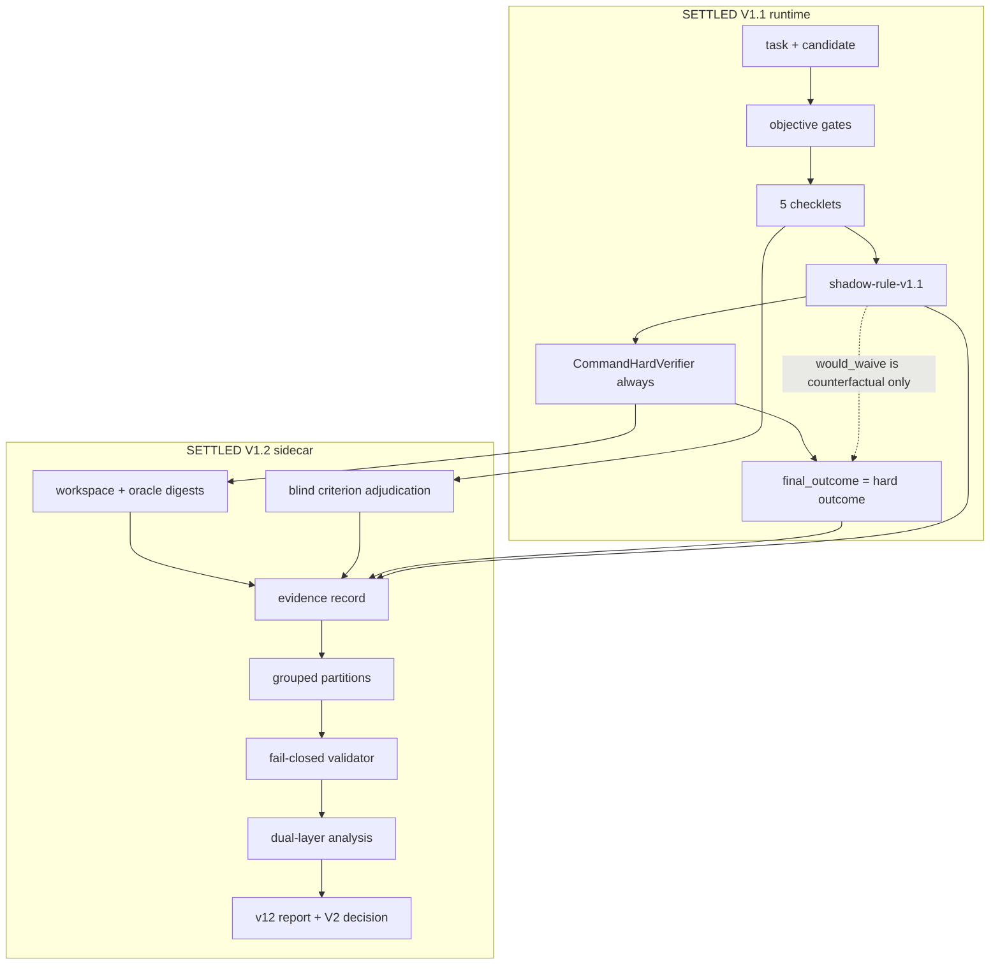

# Verification Slice V1.2 — Real-Task Evidence Program

VS-V1.2 is a measurement system. It evaluates the frozen VS-V1.1 checklets against independently hard-verified coding tasks. It does not waive hard verification, train a risk model, or add a sixth checklet.



## Safety invariant

`VerificationRunner.run()` still records the shadow decision and then unconditionally invokes the hard verifier. `VerificationRun.final_outcome` is still derived only from `HardVerifierResult`. Selective verification remains off.

## Two truth layers

Criterion truth answers: when a checklet fires, is its narrow claimed defect actually present?

Hard-verifier truth answers: did the independent oracle reject this exact candidate?

These layers must not be collapsed. An accepted artifact can have a true criterion finding. A rejected artifact can have a false checklet finding.

## Operator commands

```powershell
python -m unittest discover -s tests -v

python -m verification_v1 validate-baseline

python -m verification_v1 ingest-fixture-set evals/verification_v1/engineering_fixture_set.json --dataset-out evals/verification_v1/v12/pilot_dataset.json --freeze

python -m verification_v1 adjudicate task.json artifact.json

python -m verification_v1 validate-dataset evals/verification_v1/v12/metric_integrity_dataset.json

python -m verification_v1 analyze-v12 evals/verification_v1/v12/metric_integrity_dataset.json --report-dir reports/verification_v1

python -m verification_v1 finalize-holdout --receipt-out evals/verification_v1/v12/holdout_unseal.json

python -m verification_v1 report-v12 evals/verification_v1/v12/metric_integrity_dataset.json --report-dir reports/verification_v1

python -m verification_v1 replay-v12 record.json --mode analysis-only
```

Existing V1.1 commands are unchanged: `run`, `evaluate`, `replay`, `list-checklets`.

V1.2 reports write `reports/verification_v1/v12_latest.json` and `v12_latest.md`. They do not overwrite V1.1 `latest.json` / `latest.md`.

## Dataset partitions

Partition assignment is `hash(grouped-sha256-v1 + seed + repository_id::task_family_id) % 100`:

- 0–39 development
- 40–59 policy_selection
- 60–79 calibration_reserved
- 80–99 holdout

Default `analyze-v12` is **operational**: development + policy_selection only. `calibration_reserved` stays sealed for future V2 calibration. Holdout requires a one-way `finalize-holdout` receipt:

```powershell
python -m verification_v1 finalize-holdout --receipt-out evals/verification_v1/v12/holdout_unseal.json
python -m verification_v1 analyze-v12 evals/verification_v1/v12/pilot_dataset.json --scope final-holdout --unseal-receipt evals/verification_v1/v12/holdout_unseal.json --report-dir reports/verification_v1
```

Checklet-tuning utilities may use development only. They cannot read calibration or holdout.

## Baseline reconstructability

`validate-baseline` requires a content-addressed source snapshot of the frozen V1.1 files (`vs-v1.1-baseline-001.sources.json`). Live files, recorded hashes, and snapshot bytes must match. Git HEAD matching the snapshot is reported separately as `git_reconstructable`. Collection should not start until the snapshot is reconstructable.

## Criterion labels

Shared-primitive inspection remains a cheap secondary label. V2 decision-grade criterion metrics use the AST inspector in `independent_adjudication.py` or bounded expert review. That inspector does not import checklet helpers such as `requirement_evidence_present`. Expert packets omit checklet verdicts.

## V2 decision gate

The report emits exactly one of:

- `PROCEED_TO_V2_RESEARCH`
- `REWORK_CHECKLET_SET`
- `COLLECT_MORE_V1_2_DATA`
- `DIAGNOSTIC_VALUE_ONLY`
- `STOP_SELECTIVE_VERIFICATION_PATH`

`PROCEED_TO_V2_RESEARCH` does not authorize production selective verification. A principal cohort still needs 50–200 heterogeneous real hard-verified tasks. Engineering fixtures and controlled mutations are labeled as such and cannot be silently mixed into real-task prevalence.
